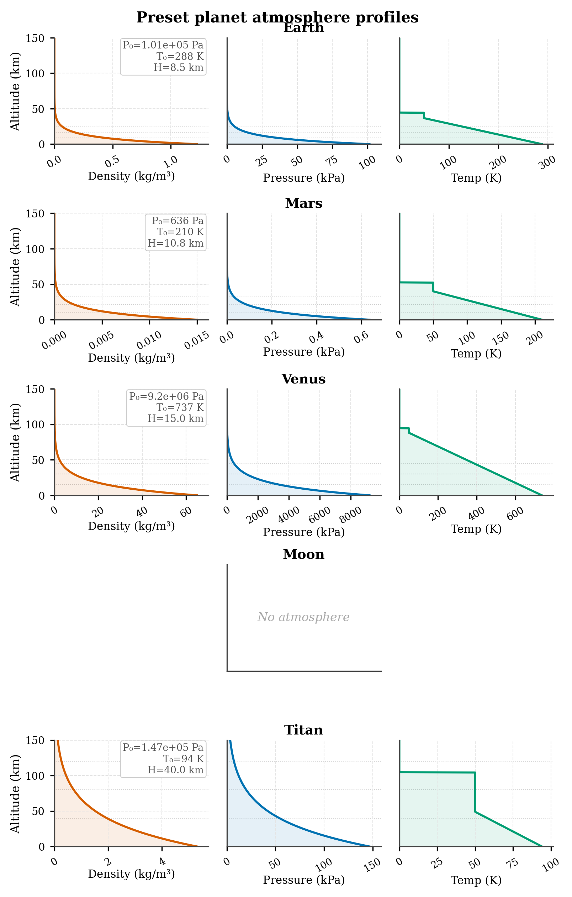
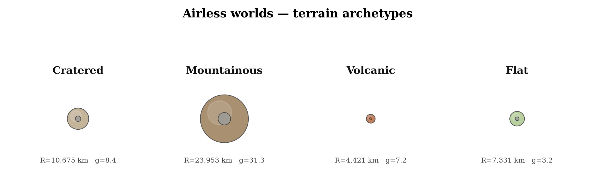
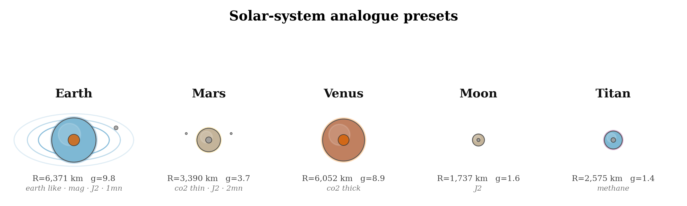
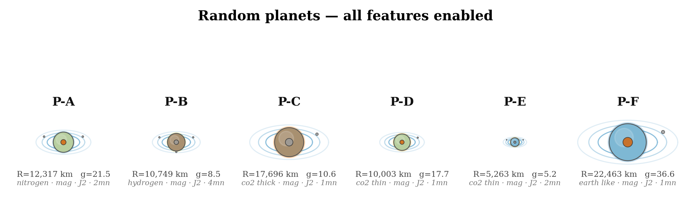
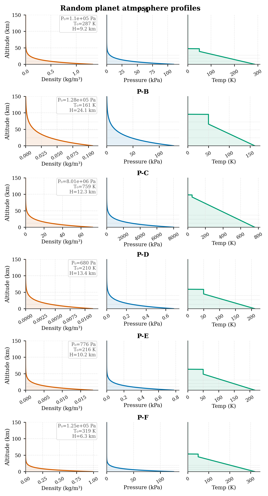
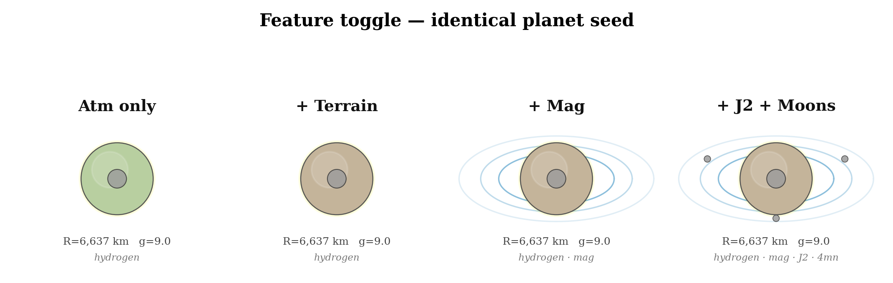
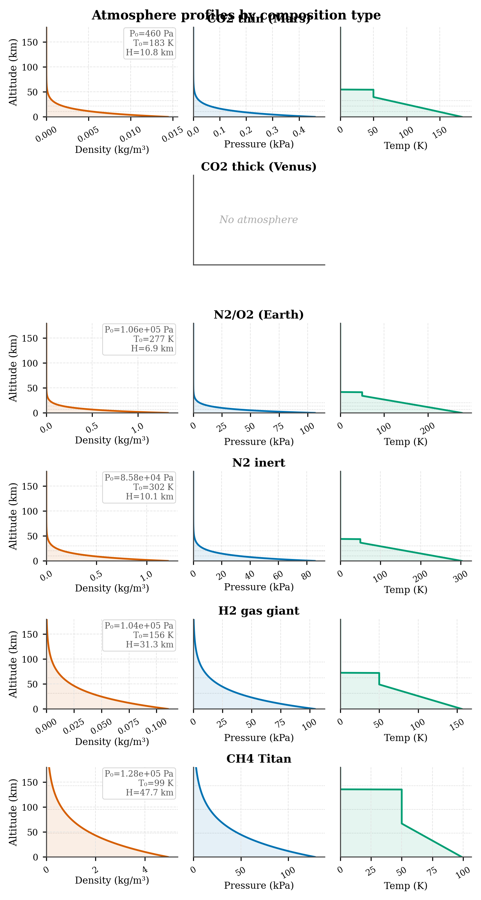
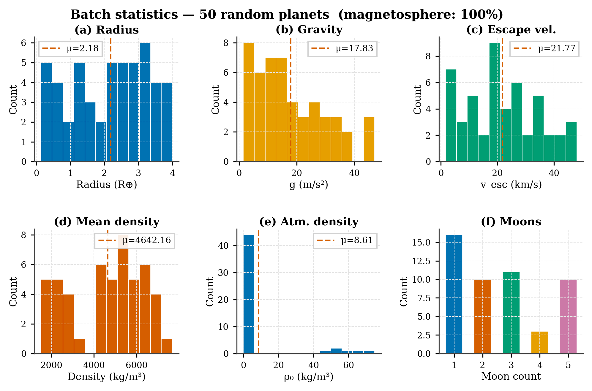

# 🪐 Planet-RL Sandbox

> A procedural planet generation and orbital mechanics sandbox for training reinforcement learning agents to perform orbital insertion across any planet in the universe.

---

## Overview

**Planet-RL** is a pure-Python simulation environment purpose-built for RL generalisation research. The core challenge: train a single agent that can perform orbital insertion around a planet it has never seen before — with no retraining, no fine-tuning.

Every planetary feature is independently toggleable: atmosphere, terrain, magnetic field, gravity harmonics (J2/J3), and moons. This makes it trivial to implement staged curriculum training — start with a fixed, simple world and progressively introduce complexity as the agent improves.

The five solar system analogue presets (Earth, Mars, Venus, Moon, Titan) let you validate that the physics models behave correctly before switching to random generation.

---

## Project Structure

```
Planet-RL/
├── demo.py                    # Standalone demo — run this first
├── test_planets.py            # Full figure generation suite
├── README.md
│
├── core/
│   ├── __init__.py            # Full public API surface
│   ├── planet.py              # Planet dataclass + 5 sub-system configs + physics helpers
│   ├── generator.py           # PlanetGenerator class + 5 real-world presets
│   ├── physics.py             # SpacecraftState, OrbitalIntegrator, RK4/RK45
│   └── env.py                 # Gymnasium-compatible OrbitalInsertionEnv
│
├── visualization/
│   ├── __init__.py
│   └── visualizer.py          # 5 publication-ready plot functions, Wong palette
│
└── figures/                   # Output from test_planets.py
    ├── fig1a_preset_crosssec.png
    ├── fig1b_preset_atm.png
    ├── fig2a_random_crosssec.png
    ├── fig2b_random_atm.png
    ├── fig3_atm_zoo.png
    ├── fig4_airless.png
    ├── fig5_toggle.png
    └── fig6_batch.png
```

---

## Installation

No compiled extensions, no simulation framework. Pure Python.

```bash
pip install numpy matplotlib gymnasium
```

**Python 3.9+** recommended. `gymnasium` is optional — `env.py` stubs gracefully without it so the rest of the codebase still imports fine.

---

## Quick Start

```bash
cd Planet-RL

# Run the demo (prints planet summaries, simulates an insertion burn)
python demo.py

# Generate all figures to ./figures/
python test_planets.py
```

All scripts must be run from the `Planet-RL/` root directory since imports use the flat `core.*` style.

---

## Architecture

Planet-RL is structured in four layers that each build on the one below:

```
OrbitalInsertionEnv        ← Gymnasium interface: obs, action, reward, reset
        ↓
OrbitalIntegrator          ← RK4 physics loop: gravity + thrust + drag + heating
        ↓
Planet                     ← Physical model: gravity, atmosphere, J2, moons
        ↓
PlanetGenerator / PRESETS  ← Planet construction: procedural or preset
```

---

## 1. The Planet Model (`core/planet.py`)

A `Planet` is a dataclass with five independently toggleable sub-systems. Every sub-system has an `enabled: bool` flag — when `False`, that system contributes nothing to the simulation and costs nothing to evaluate.

### Core Physical Parameters

| Parameter | Type | Description |
|---|---|---|
| `name` | `str` | Display name |
| `radius` | `float` | Planet radius in metres |
| `mass` | `float` | Planet mass in kg |
| `rotation_period` | `float` | Sidereal day in seconds (negative = retrograde) |

### Read-Only Derived Properties

```python
planet.mu                     # G·M  [m³/s²]
planet.surface_gravity        # μ/R²  [m/s²]
planet.escape_velocity        # √(2μ/R)  [m/s]
planet.first_cosmic_velocity  # √(μ/R)  [m/s]  — minimum orbital speed at surface
planet.mean_density           # M / (4/3·π·R³)  [kg/m³]
planet.volume                 # m³
planet.surface_area           # m²
```

### Orbital Mechanics Helpers

```python
from core import PRESETS

mars = PRESETS["mars"]()

# Circular orbit parameters at 300 km altitude
v_circ = mars.circular_orbit_speed(300_000)   # → 3407.7 m/s
T_orb  = mars.circular_orbit_period(300_000)  # → 6887.5 s  (~115 min)

# Hohmann transfer delta-v from 200 km parking orbit to 500 km target
dv_depart, dv_arrive = mars.hohmann_delta_v(200_000, 500_000)

# Point-mass gravity at altitude
g_80km = mars.gravity_at_altitude(80_000)     # → 3.57 m/s²

# Full J2-perturbed gravity vector in ECI frame
gx, gy, gz = mars.gravity_vector_J2((rx, ry, rz))

# Aerodynamic deceleration at 50 km, 5 km/s
a_drag = mars.aerobraking_deceleration(
    altitude=50_000, speed=5000,
    Cd=2.2, area=10.0, sc_mass=1000.0
)

# Atmosphere queries at any altitude
rho  = mars.atmosphere.density_at_altitude(30_000)     # kg/m³
pres = mars.atmosphere.pressure_at_altitude(30_000)    # Pa
temp = mars.atmosphere.temperature_at_altitude(30_000) # K

# Print a full summary
print(mars.summary())
# ═══ Mars ═══
#   Radius          : 3389.5 km  (0.532 R⊕)
#   Mass            : 6.417e+23 kg  (0.107 M⊕)
#   Surface gravity : 3.728 m/s²
#   Escape velocity : 5.027 km/s
#   ...
```

---

### 1a. Atmosphere Sub-system (`AtmosphereConfig`)

Seven named compositions, each calibrated to a real solar system body, with ±30% stochastic jitter applied during random generation.

| Composition | Analogue | P₀ (Pa) | ρ₀ (kg/m³) | H (km) | T₀ (K) |
|---|---|---|---|---|---|
| `EARTH_LIKE` | Earth | 101,325 | 1.225 | 8.5 | 288 |
| `CO2_THIN` | Mars | 636 | 0.015 | 10.8 | 210 |
| `CO2_THICK` | Venus | 9,200,000 | 65.0 | 15.0 | 737 |
| `METHANE` | Titan | 146,700 | 5.3 | 40.0 | 94 |
| `NITROGEN` | Inert world | 101,325 | 1.16 | 9.0 | 300 |
| `HYDROGEN` | Gas giant envelope | 100,000 | 0.09 | 27.0 | 165 |
| `NONE` | Vacuum | — | 0 | — | — |

**Physical models:**

- **Density:** `ρ(h) = ρ₀ · exp(−h / H)`  (exponential scale height)
- **Pressure:** `P(h) = P₀ · exp(−h / H)`
- **Temperature:** linear lapse at rate `Γ` up to tropopause, isothermal above
- **Drag force:** `F = ½ρv²·Cd·A·drag_coeff_multiplier`
- **Aeroheating:** Sutton-Graves: `q̇ = k·√ρ·v³`

Additional atmosphere fields:

```python
planet.atmosphere.wind_enabled         # bool
planet.atmosphere.wind_speed_mps       # m/s
planet.atmosphere.wind_direction_deg   # degrees
planet.atmosphere.drag_coeff_multiplier  # global scale on all drag
```



*Density (orange), pressure (blue), and temperature (green) profiles for all five presets. Note the dramatic scale differences: Venus has a surface density 53× denser than Earth and a pressure over 90× higher. Titan has a very tall atmosphere relative to its tiny radius. The Moon shows "no atmosphere" — the integrator returns zero drag whenever `atmosphere.enabled = False`.*

---

### 1b. Terrain Sub-system (`TerrainConfig`)

Five archetypes. Terrain affects the visual appearance of cross-section plots and provides elevation data for low-altitude trajectory analysis.

| Terrain type | Character |
|---|---|
| `FLAT` | Minimal topography, very low roughness |
| `CRATERED` | Impact-dominated, moderate roughness |
| `MOUNTAINOUS` | High elevation variance, jagged |
| `OCEANIC` | Average elevation below zero, smooth |
| `VOLCANIC` | Extreme relief, volcanic province texture |
| `RANDOM` | Randomly selected at generation time |

```python
from core import TerrainType

planet = gen.generate(
    name="Hellworld",
    terrain_enabled=True,
    terrain_type=TerrainType.VOLCANIC,
)

planet.terrain.max_elevation   # m  (highest peak)
planet.terrain.min_elevation   # m  (deepest trench, negative)
planet.terrain.roughness       # 0.0 (glassy) → 1.0 (extreme)
```



*Four terrain types with atmosphere disabled. Surface colour reflects the terrain archetype. The volcanic world has a red core (high mean density > 5000 kg/m³). All four are drawn to scale relative to each other using `ref_radius`.*

---

### 1c. Magnetic Field Sub-system (`MagneticFieldConfig`)

| Strength | Character |
|---|---|
| `NONE` | No field |
| `WEAK` | Remnant crustal field (~10% Earth) |
| `MEDIUM` | Full dipole field (Earth-like) |
| `STRONG` | Giant planet magnetosphere |

```python
planet.magnetic_field.enabled
planet.magnetic_field.strength             # MagneticFieldStrength enum
planet.magnetic_field.tilt_deg            # dipole tilt from rotation axis (0–30°)
planet.magnetic_field.radiation_belt_enabled
planet.magnetic_field.inner_belt_altitude  # m
planet.magnetic_field.outer_belt_altitude  # m
```

When enabled, the magnetic field is visualised as blue arcs in cross-section plots. Radiation belts are a metadata flag for future spacecraft charging models.

---

### 1d. Oblateness Sub-system (`OblatenessConfig`)

Full J2 (and J3) gravity harmonic support. When enabled, `gravity_vector_J2()` returns the perturbed acceleration, causing the characteristic nodal precession and apsidal drift that a real agent would need to account for.

```python
planet.oblateness.J2          # e.g. 1.08263e-3 for Earth
planet.oblateness.J3          # e.g. -2.53e-6 for Earth
planet.oblateness.flattening  # (a - c) / a
```

During random generation, J2 scales with rotation rate: fast-spinning planets become more oblate, matching the physics of centrifugal flattening.

---

### 1e. Moons Sub-system (`MoonConfig`)

N-body gravitational perturbations from up to 5 moons. Moon count is sampled from a weighted distribution (1 moon most likely, 5 least likely).

```python
planet.moons.count          # 1–5
planet.moons.mass_fraction  # moon mass / planet mass
planet.moons.orbit_radius   # semi-major axis [m]
```

In cross-section plots, up to 3 moons are shown as small grey dots at scaled orbital distance.

---

## 2. Planet Generator (`core/generator.py`)

### Five Real-World Presets

```python
from core import PRESETS

earth = PRESETS["earth"]()
mars  = PRESETS["mars"]()
venus = PRESETS["venus"]()
moon  = PRESETS["moon"]()
titan = PRESETS["titan"]()
```

All preset values match published planetary data. Earth has J2 = 1.08263×10⁻³, flattening = 1/298.257, one moon at 384,400 km, medium magnetic field with radiation belts. Mars has J2 = 1.960×10⁻³, two moons, no magnetic field.



*All five presets drawn to scale using `ref_radius = max(p.radius for p in presets)`. Earth and Venus are nearly identical in size. Mars is about half Earth's radius. The Moon and Titan are both small — Titan slightly larger. Earth's magnetic field arcs are visible. Mars and Moon have no arcs (field disabled). The lone moon of Earth is shown as a dot at scaled distance.*

---

### Procedural Generation

```python
from core import PlanetGenerator, AtmosphereComposition, TerrainType

gen = PlanetGenerator(seed=42)

# Fully featured random planet
planet = gen.generate(
    name="Zephyria",
    atmosphere_enabled=True,
    terrain_enabled=True,
    magnetic_field_enabled=True,
    oblateness_enabled=True,
    moons_enabled=True,
)

# Airless rock — good for curriculum Stage 1
barren = gen.generate(
    name="Barren-IV",
    atmosphere_enabled=False,
    terrain_enabled=True,
    magnetic_field_enabled=False,
    oblateness_enabled=False,
    moons_enabled=False,
)

# Lock to a specific atmosphere composition
titan_clone = gen.generate(
    name="Titan-2",
    atmosphere_enabled=True,
    atmosphere_composition=AtmosphereComposition.METHANE,
)

# Lock to a specific terrain type
volcanic = gen.generate(
    name="Hellworld",
    terrain_enabled=True,
    terrain_type=TerrainType.VOLCANIC,
)

# Constrain the physical size and density
dense_dwarf = gen.generate(
    name="Ironcore",
    radius_range=(0.2 * 6.371e6, 0.6 * 6.371e6),  # 0.2–0.6 R⊕
    density_range=(7000, 9500),                     # iron-core densities
    atmosphere_enabled=False,
)
```

### `generate()` — Full Parameter Reference

| Parameter | Type | Default | Description |
|---|---|---|---|
| `name` | `str` | `"Random-Planet"` | Planet display name |
| `radius_range` | `tuple[float, float]` | `(0.1·R⊕, 4·R⊕)` | Radius bounds in metres |
| `density_range` | `tuple[float, float]` | `(1500, 8000)` | Mean density bounds in kg/m³ |
| `atmosphere_enabled` | `bool` | `True` | Enable atmosphere sub-system |
| `atmosphere_composition` | `AtmosphereComposition \| None` | `None` (random) | Pin to specific composition |
| `allow_no_atmosphere` | `bool` | `True` | Allow small planets to have no atmosphere |
| `terrain_enabled` | `bool` | `True` | Enable terrain sub-system |
| `terrain_type` | `TerrainType \| None` | `None` (random) | Pin to specific terrain type |
| `magnetic_field_enabled` | `bool` | `False` | Enable magnetic field |
| `oblateness_enabled` | `bool` | `False` | Enable J2/J3 gravity harmonics |
| `moons_enabled` | `bool` | `False` | Enable moon perturbations |
| `rotation_enabled` | `bool` | `True` | Enable rotation (for J2 scaling) |
| `retrograde_allowed` | `bool` | `True` | Allow retrograde rotation |
| `tidally_locked_allowed` | `bool` | `True` | Allow tidal locking |
| `terrain_seed` | `int \| None` | `None` | Override RNG seed for terrain |

### Batch Generation

```python
# 1000 planets for curriculum training
planets = gen.batch(
    1000,
    atmosphere_enabled=True,
    oblateness_enabled=True,
    moons_enabled=False,
)
# → list of Planet objects named "Planet-001" through "Planet-1000"
```



*Six random planets from seed 2024. P-F is a super-Earth (R = 22,463 km, g = 36.6 m/s²) — nearly 3.5× Earth's radius. P-E is sub-Mars (R = 5,263 km). The cross-sections are drawn to scale: P-F fills its cell while P-E is a tiny dot. Magnetic arcs, atmosphere halos, and moon counts all reflect the actual generated values.*



*Each composition type produces a distinct profile shape. CO₂-thick worlds (P-C) have very high surface density that collapses sharply within the first 50 km. Hydrogen atmospheres (P-B) have a long scale height — density falls slowly with altitude. CO₂-thin worlds (P-D, P-E) barely register above 30 km.*

---

## 3. Physics Engine (`core/physics.py`)

### SpacecraftState

All simulation state lives in a single `SpacecraftState` dataclass.

```python
from core import SpacecraftState

# Manual construction (position and velocity in ECI frame)
state = SpacecraftState(
    x=planet.radius + 500_000,  # 500 km above surface [m]
    y=0, z=0,
    vx=0, vy=3800, vz=0,        # prograde velocity [m/s]
    mass=2000,                   # wet mass [kg]
    dry_mass=400,                # dry mass [kg]
    heat_load=0.0,               # accumulated aeroheating [J/m²]
    time=0.0,                    # mission elapsed time [s]
)

# Factory — place directly in a circular orbit
state = SpacecraftState.circular_orbit(
    planet=planet,
    altitude=300_000,     # m
    inclination=28.5,     # degrees
    wet_mass=1500,
    dry_mass=400,
)

# Convenience properties
state.radius      # |r|  [m]  — distance from planet centre
state.speed       # |v|  [m/s]
state.fuel_mass   # mass − dry_mass  [kg]  (clamped to 0)
state.position    # np.array([x, y, z])
state.velocity    # np.array([vx, vy, vz])
```

### Orbital Elements

```python
from core import state_to_orbital_elements

elements = state_to_orbital_elements(state, planet.mu)
# Returns dict:
#   a        — semi-major axis [m]
#   e        — eccentricity
#   i        — inclination [rad]
#   RAAN     — right ascension of ascending node [rad]
#   argp     — argument of periapsis [rad]
#   nu       — true anomaly [rad]
#   energy   — specific orbital energy [J/kg]  (< 0 = bound)
#   h        — specific angular momentum magnitude [m²/s]
```

### OrbitalIntegrator

```python
from core import OrbitalIntegrator, ThrusterConfig, AeroConfig
import numpy as np

integrator = OrbitalIntegrator(
    planet=planet,
    thruster=ThrusterConfig(
        max_thrust=3000,     # N — maximum thrust force
        Isp=320,             # s — specific impulse
        enabled=True,
    ),
    aero=AeroConfig(
        enabled=True,
        Cd=2.2,              # drag coefficient
        reference_area=10.0, # m² — frontal area
        heat_flux_coeff=1.7e-4,  # Sutton-Graves constant
    ),
    method="RK4",            # "RK4" (fixed step) or "RK45" (adaptive)
)
```

**Propagating a full trajectory:**

```python
# Thrust schedule: list of (t_start, t_end, thrust_vector_N)
# Thrust vector is in the inertial ECI frame
thrust_schedule = [
    (0,   180, np.array([0, -2800, 0])),    # 3-minute retrograde burn
    (300, 330, np.array([0, -500,  0])),    # 30-second circularisation kick
]

history = integrator.propagate(
    initial_state=state,
    duration=7200,              # total simulation time [s]
    dt=5,                       # RK4 timestep [s]  (1–2 s for aerobraking)
    thrust_schedule=thrust_schedule,
)
# history: list[SpacecraftState] — one entry per timestep
# Access as: history[i].altitude, .speed, .fuel_mass, .heat_load, .time
```

**Physics modelled:**

| Effect | Model |
|---|---|
| Point-mass gravity | `a = −μ·r̂ / |r|²` |
| J2 oblateness | Full ECI perturbation tensor (when `oblateness_enabled`) |
| Atmospheric drag | `F = ½ρv²·Cd·A` |
| Aeroheating | Sutton-Graves: `q̇ = k·√ρ·v³` |
| Thrust | Vector in inertial frame, magnitude limited to `max_thrust` |
| Mass burn | Tsiolkovsky: `ṁ = −T / (Isp·g₀)` |
| Crash detection | Terminates when `|r| < planet.radius` |
| Escape detection | Terminates when specific orbital energy > 0 |

**Recommended timestep:**
- Parking orbits, coast arcs: `dt = 10–30 s`
- Powered burns: `dt = 5 s`
- Low-altitude aerobraking passes: `dt = 1–2 s`

---

## 4. RL Environment (`core/env.py`)

`OrbitalInsertionEnv` is a fully Gymnasium-compatible environment. It wraps a `Planet`, an `OrbitalIntegrator`, and a dense reward function into the standard `reset()` / `step()` interface.

### Initialisation

```python
from core import OrbitalInsertionEnv

env = OrbitalInsertionEnv(
    # ── Planet source (choose one) ──────────────────────────────
    randomize_planet=True,          # new random planet each episode (default)
    planet_preset="mars",           # always use a specific preset
    planet=my_planet,               # always use a specific Planet object
    generator_seed=42,              # for reproducible random planets

    # ── Feature toggles ─────────────────────────────────────────
    # These are passed to PlanetGenerator; ignored when planet= is set
    atmosphere_enabled=True,
    terrain_enabled=True,
    magnetic_field_enabled=False,
    oblateness_enabled=False,
    moons_enabled=False,

    # ── Mission parameters ──────────────────────────────────────
    target_altitude=300_000,        # m — desired circular orbit altitude
    target_eccentricity=0.01,       # maximum acceptable eccentricity at success
    initial_altitude=100_000,       # m above target altitude (approach altitude)
    initial_speed_ratio=1.3,        # v₀ / v_circ — hyperbolic approach speed

    # ── Spacecraft ──────────────────────────────────────────────
    wet_mass=1000.0,                # kg — total initial mass
    dry_mass=300.0,                 # kg — structure + payload (no propellant)
    max_thrust=500.0,               # N — maximum engine force
    Isp=320.0,                      # s — specific impulse

    # ── Simulation ──────────────────────────────────────────────
    dt=10.0,                        # s — RK4 integration timestep
    max_steps=2000,                 # episode step limit
    heat_limit=1e7,                 # J/m² — heat load abort threshold

    # ── Reward shaping (all tunable) ───────────────────────────
    reward_success=100.0,
    reward_crash=-50.0,
    reward_fuel_weight=0.01,
    reward_step_penalty=-0.01,
)
```

### Observation Space — 10 continuous dimensions (`float32`)

The observation encodes both the spacecraft's current state (indices 0–5) and the planet's physical identity (indices 6–9). Indices 6–9 are the **task context** — they allow a single trained policy to reason about what kind of world it is orbiting and adapt accordingly.

| Index | Name | Approximate range | Description |
|---|---|---|---|
| 0 | `altitude_norm` | 0 – 2 | Current altitude / target altitude |
| 1 | `speed_norm` | 0 – 2 | Current speed / target circular orbit speed |
| 2 | `flight_path_angle` | −1 – 1 | Flight path angle / π  (−1 = straight down) |
| 3 | `eccentricity` | 0 – 2 | Current orbital eccentricity (0 = circular) |
| 4 | `fuel_fraction` | 0 – 1 | Remaining propellant / initial propellant |
| 5 | `heat_norm` | 0 – 1 | Accumulated heat load / heat limit |
| 6 | `planet_radius_norm` | 0 – 4 | Planet radius / R⊕ |
| 7 | `surface_grav_norm` | 0 – ~5 | Surface gravity / 9.81 m/s² |
| 8 | `atm_density_norm` | 0 – ~100 | Atmospheric density at current altitude / 1.225 kg/m³ |
| 9 | `target_alt_norm` | 0 – ~1 | Target altitude / planet radius |

### Action Space — 3 continuous dimensions, all in `[−1, 1]`

| Index | Name | Mapped to | Description |
|---|---|---|---|
| 0 | `thrust_magnitude` | `[0, max_thrust]` N | Engine throttle (−1 = off, +1 = full) |
| 1 | `pitch` | `[−π/2, π/2]` rad | Thrust vector pitch angle |
| 2 | `yaw` | `[−π, π]` rad | Thrust vector yaw angle |

### Reward Function

```
r_step = −0.5 · |altitude_norm − 1|      ← penalise distance from target altitude
       + −0.5 · |speed_norm − 1|         ← penalise speed error vs circular speed
       + −0.3 · eccentricity             ← penalise non-circular orbit shape
       + −reward_fuel_weight · Δfuel     ← penalise propellant expenditure
       + reward_step_penalty             ← constant step penalty (−0.01)

r_terminal:
       + 100.0  on success
       + −50.0  on crash
```

**Success condition:** `|altitude − target| < 5% × target` AND `eccentricity < 0.05`

### Terminal and Truncation Conditions

| Condition | Signal | `info` key |
|---|---|---|
| Orbit achieved (success) | `terminated = True` | `info["success"] = True` |
| Crashed into surface | `terminated = True` | `info["crash"] = True` |
| Escaped sphere of influence | `terminated = True` | — |
| Heat limit exceeded | `terminated = True` | — |
| `max_steps` reached | `truncated = True` | — |
| Out of fuel | `truncated = True` | — |

### Step Info Dict

Every `step()` call returns an `info` dict with:

```python
info["altitude_m"]         # current altitude [m]
info["speed_mps"]          # current speed [m/s]
info["eccentricity"]       # current eccentricity
info["fuel_remaining_kg"]  # propellant remaining [kg]
info["heat_load"]          # accumulated heat [J/m²]
info["success"]            # bool
info["crash"]              # bool
info["planet_name"]        # planet name string
```

### Training Loop

```python
from core import OrbitalInsertionEnv
import numpy as np

env = OrbitalInsertionEnv(
    randomize_planet=True,
    atmosphere_enabled=True,
    oblateness_enabled=False,
    target_altitude=300_000,
)

obs, info = env.reset(seed=0)
print(f"Starting around: {info['planet_name']}")

total_reward = 0
for step in range(env.max_steps):
    action = env.action_space.sample()   # ← replace with your policy
    obs, reward, terminated, truncated, info = env.step(action)
    total_reward += reward

    if terminated or truncated:
        print(f"Episode ended after {step+1} steps")
        print(f"  Success:   {info['success']}")
        print(f"  Altitude:  {info['altitude_m']/1e3:.1f} km")
        print(f"  Ecc:       {info['eccentricity']:.4f}")
        print(f"  Fuel left: {info['fuel_remaining_kg']:.1f} kg")
        print(f"  Total reward: {total_reward:.1f}")
        break
```

### Accessing the Recorded Trajectory

```python
obs, info = env.reset()

for _ in range(500):
    obs, reward, terminated, truncated, info = env.step(env.action_space.sample())
    if terminated or truncated:
        break

trajectory = env.get_trajectory()   # list[SpacecraftState]

# Pass to visualiser
from visualization import plot_mission_telemetry
fig = plot_mission_telemetry(trajectory, env.planet, target_altitude=300_000)
fig.savefig("telemetry.png", dpi=150)
```

---

## 5. Visualisation (`visualization/visualizer.py`)

All plot functions target publication quality: **Wong (2011) colorblind-safe palette**, serif fonts, 7–9 pt labels, no top/right spines. Output is simultaneously saved as 300 dpi PNG and vector PDF with embedded Type-42 fonts.

### Import

```python
from visualization import (
    plot_planet_cross_section,   # schematic diagram of a planet
    plot_atmosphere_profile,     # density / pressure / temperature panels
    plot_trajectory_2d,          # orbital trajectory coloured by speed or fuel
    plot_mission_telemetry,      # 4-panel altitude/speed/fuel/heat dashboard
    plot_planet_comparison,      # bar chart comparing a list of planets
    save_figure,                 # save as PNG + PDF in one call
    apply_journal_style,         # set global matplotlib rcParams
)
```

---

### `plot_planet_cross_section(planet, ax=None, ref_radius=None)`

Schematic cross-section showing: terrain colour, atmosphere halos (scaled to actual scale height), magnetic field arcs, core colour (red = iron-rich, grey = rocky), and moons.

The key parameter is `ref_radius`. When drawing multiple planets side by side, pass `ref_radius = max(p.radius for p in group)` to all of them. Each planet is then drawn at `scale = planet.radius / ref_radius`, so relative sizes are physically accurate. Leave `ref_radius=None` for standalone single-planet figures.

```python
import matplotlib.pyplot as plt
from core import PRESETS
from visualization import plot_planet_cross_section, save_figure

planets = [PRESETS[k]() for k in PRESETS]
ref     = max(p.radius for p in planets)

fig, axes = plt.subplots(1, 5, figsize=(10, 2.8),
                          gridspec_kw=dict(wspace=0.05))
fig.patch.set_facecolor("white")

for ax, planet in zip(axes, planets):
    plot_planet_cross_section(planet, ax=ax, ref_radius=ref)

save_figure(fig, "presets", output_dir="figures")
```



*Same planet seed generated four times with features added incrementally. Left: atmosphere only. Second: terrain added (surface colour changes from pale green to brown). Third: magnetic field added (arcs appear). Right: J2 + 4 moons added (dots appear at orbital distance).*

---

### `plot_atmosphere_profile(planet, axes=None, max_altitude_km=150)`

Draws a three-panel profile: density | pressure | temperature. Each panel is an independent subplot sharing only the y-axis (altitude). The leftmost panel shows the y-label and tick marks; the others suppress them to avoid redundancy.

**Always pass exactly 3 `Axes` objects** when embedding in a larger figure. When `axes=None`, a standalone `(6.0, 2.8)` figure is created automatically.

```python
import matplotlib.pyplot as plt
from visualization import plot_atmosphere_profile
from core import PRESETS

# Standalone figure for one planet
fig, axes = plt.subplots(1, 3, figsize=(6, 2.8), sharey=True)
fig.subplots_adjust(wspace=0.10, left=0.12, right=0.97)
plot_atmosphere_profile(PRESETS["venus"](), axes=axes, max_altitude_km=120)
plt.show()
```

When embedding in a multi-planet figure, create each triplet with `sharey` between its own three axes:

```python
import matplotlib.pyplot as plt
import matplotlib.gridspec as gridspec
from visualization import plot_atmosphere_profile

planets = [...]   # list of N planets
fig = plt.figure(figsize=(5.5, N * 1.8))
gs  = gridspec.GridSpec(N, 3, figure=fig, wspace=0.12, hspace=0.65)

for row, planet in enumerate(planets):
    ax0 = fig.add_subplot(gs[row, 0])
    ax1 = fig.add_subplot(gs[row, 1], sharey=ax0)
    ax2 = fig.add_subplot(gs[row, 2], sharey=ax0)
    plot_atmosphere_profile(planet, axes=[ax0, ax1, ax2])
```



*One planet per atmosphere type. The scale of each panel is independent, so the dramatically different pressure regimes are all clearly visible. CO₂-thick (Venus analogue) shows 9.2 MPa surface pressure and 65 kg/m³ surface density — over 50× denser than Earth at sea level. Methane and hydrogen worlds have long scale heights, giving a gently curved profile that extends to high altitude. CO₂-thin (Mars) is barely visible above 40 km. Planets with no atmosphere show a single "No atmosphere" label.*

---

### `plot_trajectory_2d(planet, trajectory, ax=None, target_altitude, color_by)`

Top-down equatorial-plane view of a trajectory. The path is coloured by either speed (plasma colormap) or fuel remaining (red–yellow–green). A dashed ring marks the target orbit. Start and end positions are marked.

```python
from visualization import plot_trajectory_2d
import matplotlib.pyplot as plt

fig, ax = plt.subplots(figsize=(5, 5))
plot_trajectory_2d(
    planet=mars,
    trajectory=history,         # list[SpacecraftState] from integrator.propagate()
    ax=ax,
    target_altitude=300_000,    # m
    color_by="speed",           # "speed" or "fuel"
)
plt.tight_layout()
plt.show()
```

---

### `plot_mission_telemetry(trajectory, planet, target_altitude, figsize)`

Four-panel dashboard showing the full timeline of a simulated insertion: altitude vs. time, speed vs. time, propellant mass vs. time, and accumulated heat load vs. time. Reference dashed lines mark the target altitude and target circular orbit speed.

```python
from visualization import plot_mission_telemetry, save_figure

fig = plot_mission_telemetry(
    trajectory=history,
    planet=mars,
    target_altitude=300_000,
    figsize=(7.0, 4.5),
)
save_figure(fig, "insertion_telemetry", output_dir="figures")
```

---

### `plot_planet_comparison(planets, figsize)`

Vertical bar chart comparing up to ~10 planets across four metrics: radius (in R⊕), surface gravity, escape velocity, and surface atmosphere density. Each planet gets a distinct Wong-palette colour.

```python
from visualization import plot_planet_comparison
from core import PRESETS

presets = [PRESETS[k]() for k in PRESETS]
fig = plot_planet_comparison(presets, figsize=(7.0, 3.2))
plt.show()
```

---

### `save_figure(fig, filename, output_dir, dpi_png, formats)`

Saves both a raster PNG and a vector PDF in one call. PDF output uses `pdf.fonttype=42` (TrueType embedding) for compatibility with IEEE, Elsevier, and Nature submission portals.

```python
from visualization import save_figure

save_figure(fig, "my_figure", output_dir="figures")
# → figures/my_figure.png  (300 dpi by default)
# → figures/my_figure.pdf  (vector, fonts embedded)

# Override DPI for camera-ready submission
save_figure(fig, "my_figure", output_dir="figures", dpi_png=600)
```

---

### Colour Palette & Style Constants

Planet-RL uses the **Wong (2011)** 8-colour palette throughout. It is distinguishable under deuteranopia and protanopia, and all eight colours remain distinct in black-and-white printing.

```python
from visualization import (
    WONG,        # full 8-colour list
    WONG_CYCLE,  # alias for WONG
    W_BLUE,      # "#0072B2"  — used for pressure profiles, altitude
    W_RED,       # "#D55E00"  — used for density profiles, speed
    W_GREEN,     # "#009E73"  — used for temperature profiles, fuel
    W_ORANGE,    # "#E69F00"  — used for aeroheating, secondary data
    W_BLACK,     # "#000000"  — used for reference lines, targets
)
```

Typography constants (all in points):

```python
from visualization import FT, FL, FK, FG, FA, LW, LW2

FT   # 9   — axes title
FL   # 8   — axis label
FK   # 7   — tick label
FG   # 7   — legend text
FA   # 6.5 — annotation text
LW   # 1.4 — main line weight
LW2  # 0.9 — reference/guide line weight
```

---

### `apply_journal_style()`

Sets global `matplotlib.rcParams` to journal style. Called automatically when `visualization` is imported, but can be called manually to restore settings after overrides.

```python
from visualization import apply_journal_style
apply_journal_style()
```

---

## Running the Figure Suite

`test_planets.py` generates and saves 8 figures to `./figures/`. Run it from the project root:

```bash
python test_planets.py
```

| Figure file | What it shows |
|---|---|
| `fig1a_preset_crosssec.png` | Five presets drawn to scale with all features |
| `fig1b_preset_atm.png` | Atmosphere profiles for all five presets |
| `fig2a_random_crosssec.png` | Six random planets (seed 2024) drawn to scale |
| `fig2b_random_atm.png` | Atmosphere profiles for the same six random planets |
| `fig3_atm_zoo.png` | One planet per atmosphere composition type |
| `fig4_airless.png` | Four terrain archetypes with atmosphere disabled |
| `fig5_toggle.png` | Same seed, features added one at a time |
| `fig6_batch.png` | Statistical histograms over 50-planet batch |



*Physical parameter distributions over a 50-planet batch with all features on. Radius spans 0.14–4.0 R⊕ (nearly 30×). Gravity spans 1.5–47 m/s² (30×). This diversity is intentional — a well-trained agent should handle all of it from a single policy.*

---

## Curriculum Design

The feature toggles exist specifically to enable staged training. The recommended progression:

```
Stage 1 — Baseline
  randomize_planet=False, planet_preset="earth"
  atmosphere_enabled=False, oblateness_enabled=False, moons_enabled=False
  Goal: learn a basic retrograde burn to capture into orbit

Stage 2 — Planet variance
  randomize_planet=True
  radius_range=(0.8·R⊕, 1.2·R⊕), density_range=(4500, 6000)
  atmosphere_enabled=False
  Goal: learn to read planet_radius_norm and surface_grav_norm from obs

Stage 3 — Thin atmosphere
  atmosphere_enabled=True, atmosphere_composition=CO2_THIN
  Goal: learn to account for mild drag during insertion passes

Stage 4 — Full atmosphere diversity
  atmosphere_enabled=True  (all compositions)
  Goal: generalise across Earth-like, Venus-like, and gas-giant envelopes

Stage 5 — Oblateness + full planet diversity
  oblateness_enabled=True, full radius/density ranges
  Goal: handle J2-induced perturbations during multi-orbit insertions

Stage 6 — All features on
  magnetic_field_enabled=True, moons_enabled=True
  Goal: handle the full randomised environment
```

---

## Recommended RL Algorithms

| Algorithm | Notes |
|---|---|
| **SAC** (Soft Actor-Critic) | Best overall. Sample-efficient, handles continuous thrust naturally, stable with dense rewards |
| **TD3** | Deterministic alternative to SAC. Slightly more stable in early training |
| **PPO** | Easy baseline, interpretable, works well with normalised observations |
| **SAC + HER** | Add Hindsight Experience Replay if you switch to sparse rewards |
| **MAML / PEARL** | Meta-RL: use obs[6–9] as the task context vector for explicit fast adaptation to new planets |

For generalisation research, **MAML** or **PEARL** are natural fits. The planet identity encoded in `obs[6:10]` acts as the task descriptor — inner-loop adaptation at test time gives the agent a few gradient steps (or a context encoder rollout) to calibrate to the new planet before committing to a burn.

---

## Physics Reference

### Equations of Motion

The full state vector propagated at each RK4 step is:

```
s = [x, y, z, vx, vy, vz, mass, heat_load]
```

**Equations:**

```
ds/dt:
  ẋ  = vx
  ẏ  = vy
  ż  = vz
  v̇x = a_grav_x + a_drag_x + a_thrust_x
  v̇y = a_grav_y + a_drag_y + a_thrust_y
  v̇z = a_grav_z + a_drag_z + a_thrust_z
  ṁ  = −|T| / (Isp · g₀)
  Q̇  = k · √ρ · |v|³         (Sutton-Graves aeroheating)
```

### Gravity

| Mode | Formula |
|---|---|
| Point mass | `a_grav = −μ · r / |r|³` |
| J2 correction (when enabled) | Full ECI perturbation: `a_J2 = (3/2)·J2·μ·Rₑ²/|r|⁵ · (...)` |

### Atmosphere

| Quantity | Formula |
|---|---|
| Density | `ρ(h) = ρ₀ · exp(−h / H)` |
| Pressure | `P(h) = P₀ · exp(−h / H)` |
| Temperature (troposphere) | `T(h) = T₀ − Γ·h` |
| Temperature (stratosphere) | `T = T(h_tropo)` (isothermal) |
| Drag force | `F_drag = ½·ρ·v²·Cd·A·k_drag` |
| Heat flux | `q̇ = k·√ρ·v³` |

### Propulsion

| Quantity | Formula |
|---|---|
| Thrust force | Vector: `F_thrust = T̂ · |T|` where `|T| ≤ max_thrust` |
| Mass flow | `ṁ = −|T| / (Isp · 9.80665)` |
| Exhaust velocity | `vₑ = Isp · g₀` |

### Integration

| Parameter | Value |
|---|---|
| Default method | Fixed-step RK4 |
| Alternative | Adaptive RK45 (set `method="RK45"`) |
| Default timestep | 10 s |
| Recommended for aerobraking | 1–2 s |

---

## Physical Constants (exported from `core`)

```python
from core import G, R_EARTH, M_EARTH

G       # 6.67430e-11  m³ kg⁻¹ s⁻²
R_EARTH # 6.371e6      m
M_EARTH # 5.972e24     kg
```

---

## Dependencies

```
numpy      ≥ 1.21
matplotlib ≥ 3.5
gymnasium  ≥ 0.26    (optional — env.py stubs gracefully if absent)
```

No compiled extensions. No GPU. No external simulation framework. The entire physics engine is a self-contained ~200-line pure-Python RK4 integrator in `core/physics.py`.

---

## License

MIT
